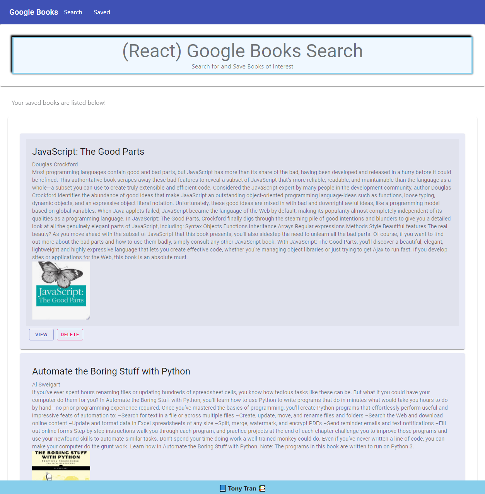
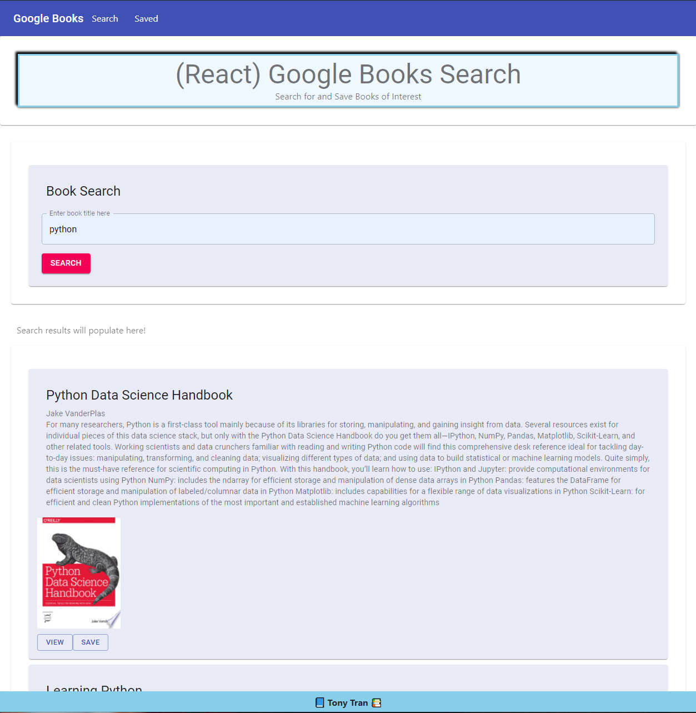

# React-Google-Book-Search

This is Google Book Search application using full stack MERN application. This was built using ReactJS for the frontend, MongoDB for data storage of saved books, Express for the API server, and Node.JS for the deploy. 

License: 

## Description 

This application will allow you to search Google Books using their API. It was built from the ground up using technologies that include Material-UI, Axios, Bootstrap, and React-Router-Dom 6 for routing. The final deployed page is hosted on Heroku with the full functionality. 

Screenshots:

## Table of Contents

* [Installation](#installation)
* [Usage](#usage)
* [License](#license)
* [Contributing](#contributing)
* [Tests](#tests)
* [Questions](#questions)
* [References](#references)

## Installation

You can use the deployed application at the link below. 

## Usage 

Here are some features of this application. 

  - user can search for books from Google Books
  - user can search by the book title or authors
  - on the search book view, user can view the book on Google Books or save it for later
  - on the saved book view, user can either view the book on Google Books or delete it from the list if they are no longer interested

Deployed: https://google-book-picks.herokuapp.com/

## License

MIT

## Contributing

If you would like to contribute to this project, you can fork a copy of the repo and make changes or improvements on your repo. Once ready, you can request a push and I will review the changes before updating the repo. 

## Tests

There are no tests with this application. Let me know if you are interested in creating a test for this application. 

## Questions

If you have any questions, feel free to contact me directly and listed below are my contact informations. 

GitHub profile: code-monkey713

Email: tony.tran713@outlook.com

## References

https://material-ui.com/
https://developers.google.com/books/docs/v1/using
